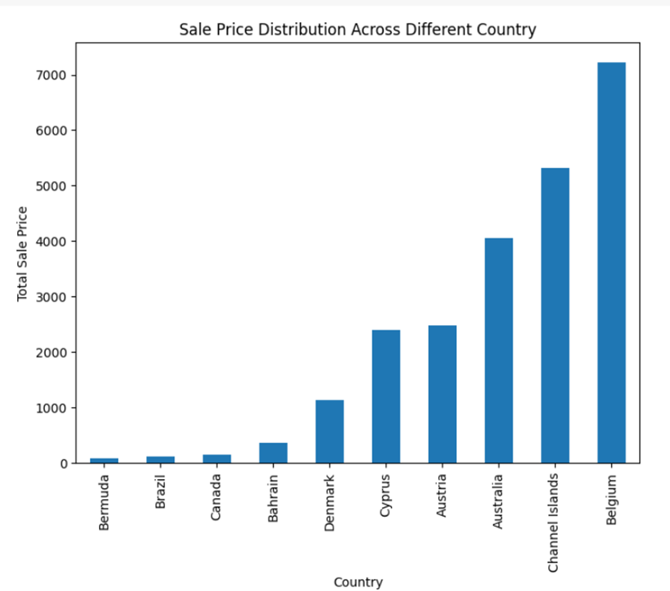
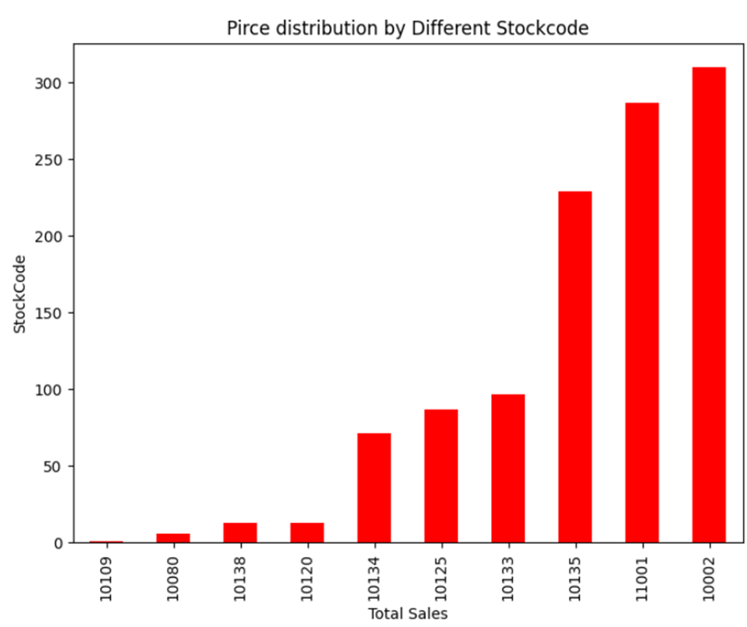
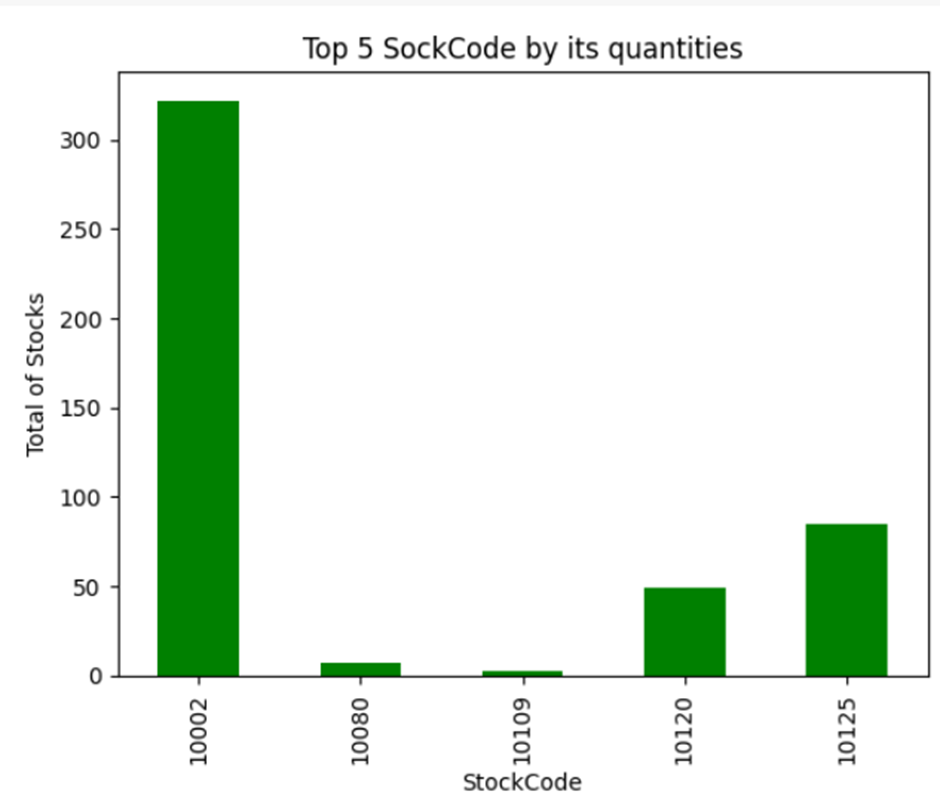
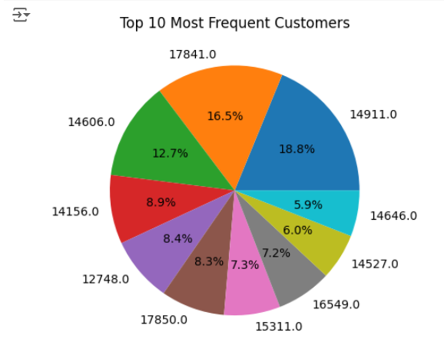
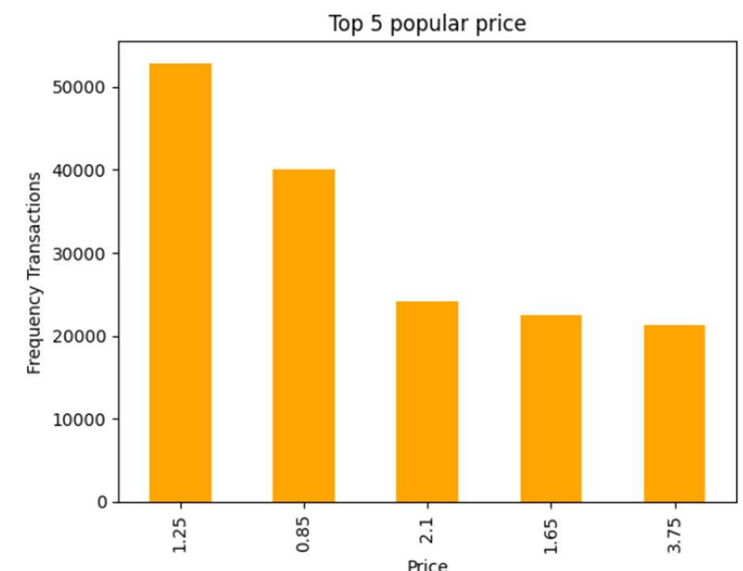
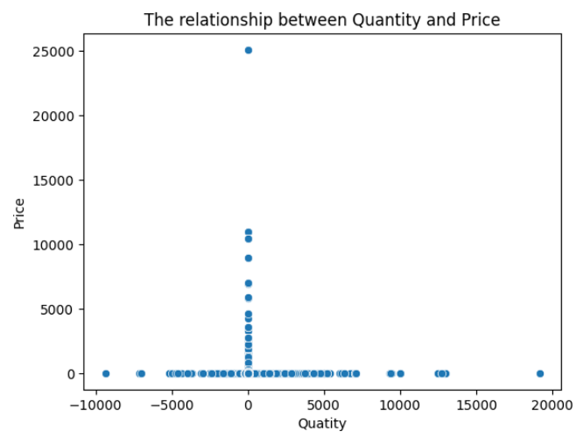

# Report

## 1.Key Insights
The analysis indicates that the top countries with the most sales are Belgium, followed by Channel Islands, Australia, Austria, and Cyprus ( See Figure 1), while the top StockCodes by price are 10002, followed by 11001, 10135, 10133, and 10125 (See Figure 2). StockCode 10002 is the most popular product with the highest quantity count (See Figure 3). Customer ID 14911 is the most popular customer ID among the top customers, accounting for 18.8% of the total for the top 10 customers, followed by 17841 with 16.5% (See Figure 4). The popular product prices are $1.25 and $0.85 (See Figure 5). There is no relation between price and quantity (See Figure 6).

## 2. Recommendations

●	Belgium, Channel Islands, Australia, Austria, and Cyprus are the top countries by sales. Investing more marketing strategies toward those countries to increase more market share or sales revenue.
●	StockCode 10002 has the highest quantity sold, indicating it’s the most popular product. Ensure there are enough stocks so that the customer will not buy other retailers.

●	Products priced at $1.25 and $0.85 are the most popular. Ensure all others produce a similar price range so that customers can afford it. Do not bring a lot of new stocks that have a higher price range because there is a high chance that the customer cannot afford it.

●	Customer ID 14911 is the top contributor, accounting for 18.8% of the top 10 customers. Hence, it is important to create a loyalty program or any promotion to ensure that all the import customers stay long term.

●	While there is no direct correlation between price and quantity, it’s still valuable to test different pricing strategies and monitor their impact on sales performance to uncover potential opportunities for optimization.

## 3. Appendix

### Sale Price Distribution Across Different Countries
  
**Figure 1:** Sale Price Distribution Across Different Countries  

### Price Distribution by Different Stock Codes
  
**Figure 2:** Price Distribution by Different Stock Codes  

### Top 5 Stock Codes by Quantity Sold
  
**Figure 3:** Top 5 Stock Codes by Quantity Sold  

### Top 10 Most Frequent Customers
  
**Figure 4:** Top 10 Most Frequent Customers  

### Frequency of Transactions
  
**Figure 5:** Frequency of Transactions  

### Relationship Between Quantity and Price
  
**Figure 6:** Relationship Between Quantity and Price  

